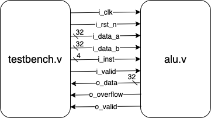

# ALU (3%)

The ALU spec is as follows:

| Signal | I/O | Width | Functionality |
| :--- | :--- | :--- | :--- |
| i\_clk | Input | 1 | Clock signal |
| i\_rst\_n | Input | 1 | Active low asynchronous reset |
| i\_data\_a | Input | 32 | Input data A may be signed or unsigned depending on the i\_inst signal |
| i\_data\_b | Input | 32 | Input data B may be signed or unsigned depending on the i\_inst signal |
| i\_inst | Input | 4 | Instruction signal representing functions to be performed |
| i\_valid | input | 1 | One clock signal when input data a and b are valid |
| o\_data | Output | 32 | Calculation result |
| o\_overflow | Output | 1 | Overflow signal |
| o\_valid | Output | 1 | Should be **one cycle signal** when your results are valid |

The test environment is as follows:

You are asked to implement the following functions in ALU:

| i\_inst | Function | Description |
| :--- | :--- | :--- |
| 4'd0 | `Signed Add` | i\_data\_a + i\_data\_b (signed) |
| 4'd1 | `Signed Sub` | i\_data\_a - i\_data\_b (signed) |
| 4'd2 | `Signed Mul` | i\_data\_a * i\_data\_b (signed) |
| 4'd3 | `Signed Max` | max(i\_data\_a, i\_data\_b) (signed) |
| 4'd4 | `Signed Min` | min(i\_data\_a, i\_data\_b) (signed) |
| 4'd5 | `Unsigned Add` | i\_data\_a + i\_data\_b (unsigned) |
| 4'd6 | `Unsigned Sub` | i\_data\_a - i\_data\_b (unsigned) |
| 4'd7 | `Unsigned Mul` | i\_data\_a * i\_data\_b (unsigned) |
| 4'd8 | `Unsigned Max` | max(i\_data\_a, i\_data\_b) (unsigned) |
| 4'd9 | `Unsigned Min` | min(i\_data\_a, i\_data\_b) (unsigned) |
| 4'd10 | `And` | i\_data\_a & i\_data\_b |
| 4'd11 | `Or` | i\_data\_a \| i\_data\_b |
| 4'd12 | `Xor` | i\_data\_a ^ i\_data\_b |
| 4'd13 | `BitFlip` | ~ i\_data\_a |
| 4'd14 | `BitReverse` | Bit reverse i\_data\_a |

More details:
*   We will compare the output data and overflow signal with the provided answers
*   For signed 32-bit integer `Add`, `Sub`, `Mul`, `Max`, `Min`
    *   Two-input signal functions
    *   Overflow signal only needs to be considered when `Add`, `Sub` or `Mul` is performed. For `Max` and `Min`, set the output overflow signal to **0**.
    *   We will **not** compare the return data with the answer provided when overflow happens
*   For unsigned 32-bit integer `Add`, `Sub`, `Mul`, `Max`, `Min`
    *   Same criteria as signed operations'
*   `Xor`, `And`, `Or`, `BitFlip`, and `BitReverse`
    *   Set output overflow signal to **0** when the above functions are performed.
    *   `Xor`, `And` and `Or` are two-input signal functions.
    *   `BitFilp` and `BitReverse` are one-input signal functions, therefore, i\_data\_b can be ignored.

Grading:
*   There are four test cases for each function. Overall, there are 60 test cases.
*   0.05% for each test case

