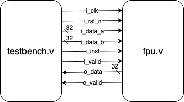
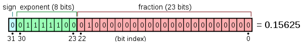
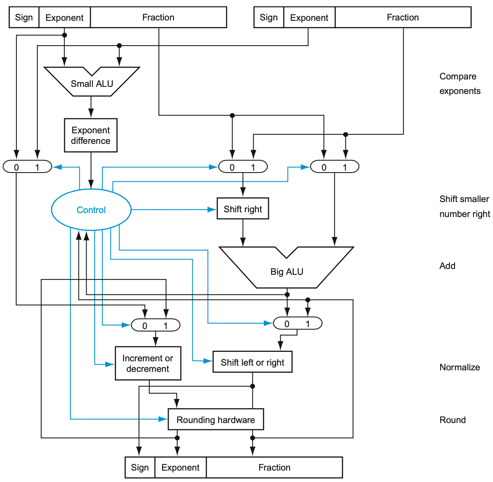

# FPU (4%)

The FPU spec is as follows:

| Signal | I/O | Width | Functionality |
| :--- | :--- | :--- | :--- |
| i\_clk | Input | 1 | Clock signal |
| i\_rst\_n | Input | 1 | Active low asynchronous reset |
| i\_data\_a | Input | 32 | Single precision floating point a |
| i\_data\_b | Input | 32 | Single precision floating point b |
| i\_inst | Input | 1 | Instruction signal representing functions to be performed |
| i\_valid | input | 1 | One clock signal when input data a and b are valid |
| o\_data | Output | 32 | Calculation result |
| o\_valid | Output | 1 | Should be **one cycle signal** when your results are valid |

The test environment is as follows:

You are asked to implement the following functions in FPU:

| i\_inst | Function | Description |
| :--- | :--- | :--- |
| 1'd0 | `Add` | i\_data\_a + i\_data\_b (single precision floating point) |
| 1'd1 | `Mul` | i\_data\_a * i\_data\_b (single precision floating point) |

Floating point:

More details:
*   We will compare the output data with provided answers.
*   Follow [IEEE-754](https://en.wikipedia.org/wiki/IEEE_754) single precision floating point format
*   The inputs will not be denormal numbers, infinites, and NaNs, nor will the calculated result.
*   Simple testcases
*   During the computation, the one with smaller exponent will be shifted, you should keep the precision until rounding. As for rounding mode, we use default **rounding to nearest even**.
    *   I find this [pdf](http://indico.ictp.it/event/7657/session/3/contribution/12/material/0/0.pdf) useful to explain the rounding and the GRS bits.
    *   The testcases may be too easy to worry about the rounding.

You may want to reference the diagram described in class to have better idea implementing FPU.

Grading:
*   There are 10 test cases for `add` and `mul`. Overall, there are 20 test cases.
*   0.5% for each test case

